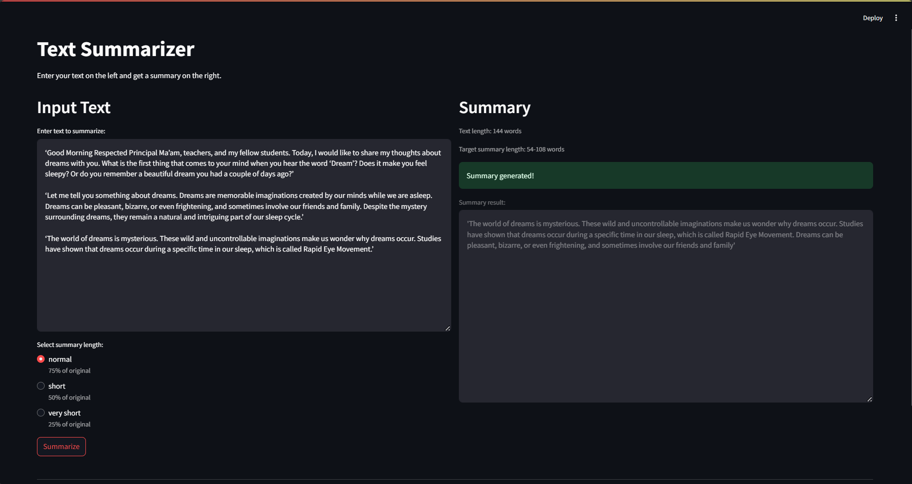
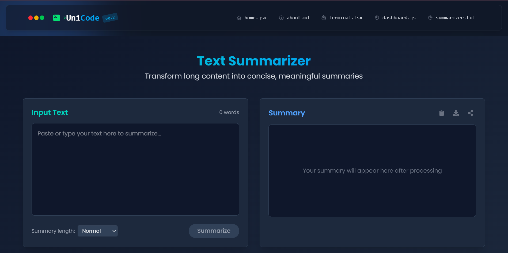

# Text Summarizer

A streamlined web application for text summarization powered by NLP technology.

## Description

This Streamlit-based application provides an intuitive interface for summarizing text. Users can enter text on the left side, select their desired summary length, and receive a concise summary on the right side.

## Features

- **Clean, Split-Screen Interface**: Input on the left, output on the right
- **Multiple Summary Lengths**:
  - Normal (75% of original)
  - Short (50% of original)
  - Very Short (25% of original)
- **Real-Time Processing**: Instantly generate summaries with visual feedback
- **Word Count Statistics**: View original and target summary word counts
## Demo
1. Not Deployed(StreamlitVersion)
</img>


2. Deployed version(Django + ReactVersion)
"A Text Summarizer using Hugging Face Transformers (DistilBART), integrated with Django REST API. Attempted AWS deployment on low-resource EC2 instance. Learned about real-world deployment constraints and optimization."
</img>

## Installation

1. Clone the repository:
   ```bash
   git clone https://github.com/yourusername/text-summarizer.git
   cd text-summarizer
   ```

2. Create and activate a virtual environment (recommended):
   ```bash
   python -m venv venv
   
   # Windows
   venv\Scripts\activate
   
   # macOS/Linux
   source venv/bin/activate
   ```

3. Install the required dependencies:
   ```bash
   pip install -r requirements.txt
   ```

## Usage

1. Start the application:
   ```bash
   cd SummarizerModel/server
   streamlit run app.py
   ```

2. The application will open in your default web browser

3. Enter or paste your text in the left panel

4. Select your desired summary length:
   - Normal: 75% of original length
   - Short: 50% of original length
   - Very Short: 25% of original length

5. Click "Summarize" to generate your summary

6. View the summary in the right panel

## Project Structure

```
TextSummarizer/
├── SummarizerModel/
│   └── server/
│       ├── app.py           # Main Streamlit application
│       └── summarizer.py    # Text summarization logic
└── requirements.txt         # Project dependencies
```

## Technical Details

The application calculates the appropriate summary length parameters based on the input text length and selected mode:

```python
normal = 3/4
short = 1/2
v_short = 1/4
len_text = len(input_text.split())

if mode_key == 'normal':
    max_len = int((len_text)*(normal))
    min_len = int(len_text*(normal/2))
elif mode_key == 'short':
    max_len = int(len_text*short)
    min_len = int(len_text*(short/2))
else:  # v_short
    max_len = int(len_text*v_short)
    min_len = int(len_text*(v_short/2))
```

## Requirements

- Python 3.8+
- Streamlit
- Additional NLP packages (specified in requirements.txt)

## License

MIT

## Acknowledgments

- Built with Streamlit
- Powered by advanced NLP summarization techniques